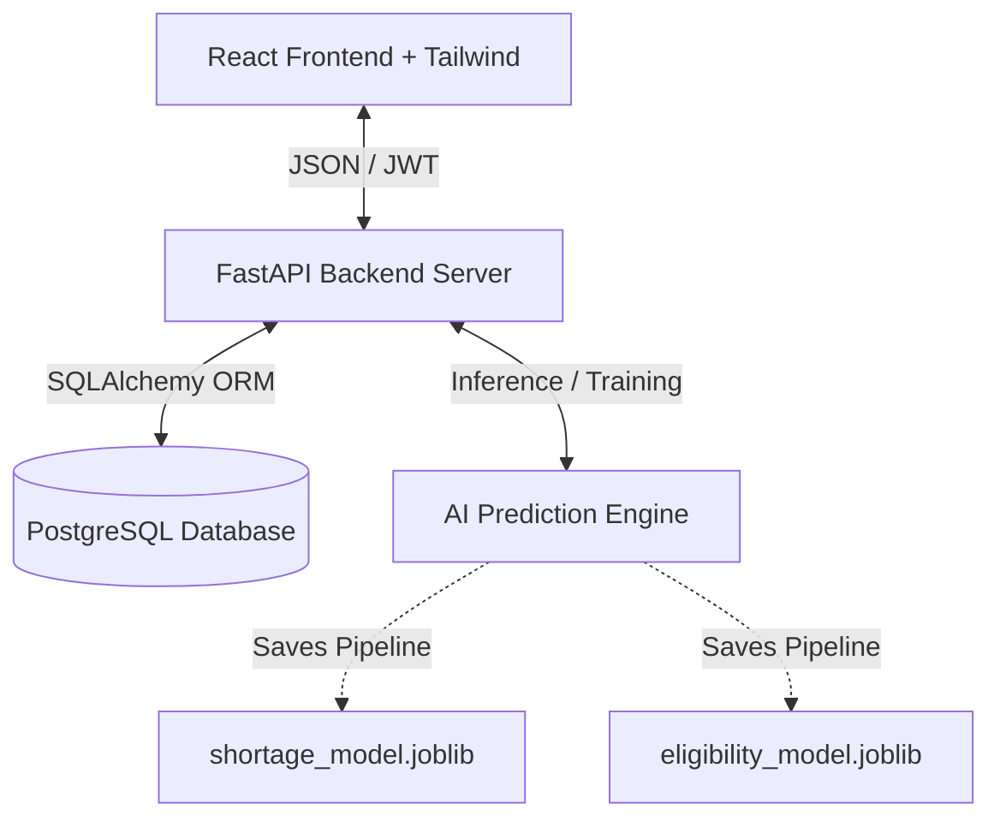
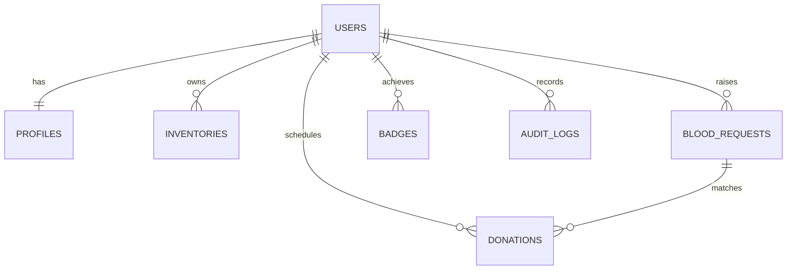
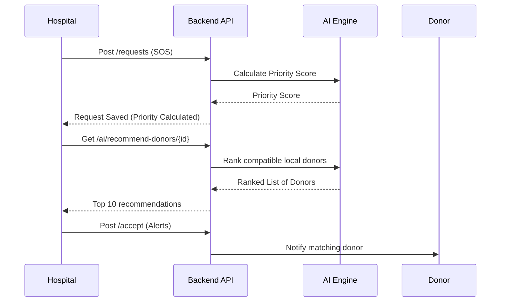
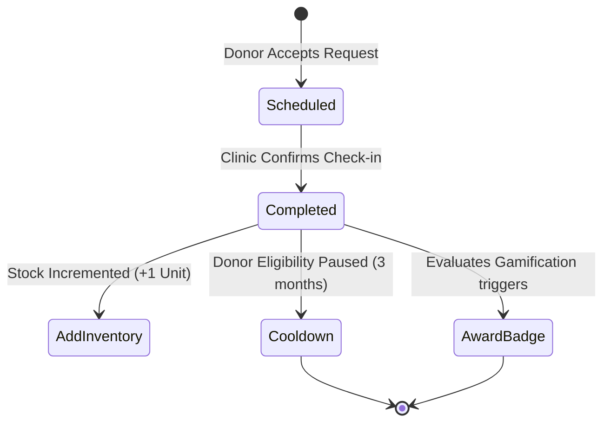

# AI Powered Digital Blood Bank

The **AI Powered Digital Blood Bank** is a production-grade digital platform connecting donors, patients, hospitals, and blood banks. The system leverages machine learning to prioritize emergency blood requests, rank optimal donors by distance and compatibility, forecast inventory shortage risks, and handle cold chain monitoring.

---

## System Architecture



---

## Entity Relationship (ER) Diagram



---

## UML Diagrams

### 1. Use Case Diagram
```mermaid
left-to-right direction
actor Admin
actor Hospital
actor Donor
actor Patient

rectangle "AI Blood Bank System" {
    Admin --> (Verify Facilities)
    Admin --> (View Telemetry Logs)
    Hospital --> (Raise SOS Broadcast)
    Hospital --> (Check AI Recommendations)
    Donor --> (Check Eligibility Score)
    Donor --> (Unlock Badges)
    Patient --> (Search Blood Stock)
    Patient --> (Track Donor Live)
}
```

### 2. Sequence Diagram (SOS Matching Flow)


### 3. Activity Diagram (Donation Lifecycle)


---

## Installation & Setup Guide

### Method A: Docker Compose (Recommended)
This runs the entire system—PostgreSQL database, FastAPI backend, and React frontend—isolated in docker containers.

1. Ensure Docker is installed and running on your system.
2. Run the following command in the root directory:
   ```bash
   docker-compose up --build
   ```
3. Once completed:
   - **Frontend client** is online at: `http://localhost`
   - **Backend API** is online at: `http://localhost:8000`
   - **Swagger documentation** is at: `http://localhost:8000/docs`

---

### Method B: Local Manual Running

#### 1. Database Setup
Ensure you have a **PostgreSQL** instance running. Create a database named `bloodbank`.

#### 2. Backend Setup
1. Open a terminal in the `backend` folder:
   ```bash
   cd backend
   ```
2. Create and activate a Python virtual environment:
   ```bash
   python -m venv venv
   .\venv\Scripts\activate
   ```
3. Install dependencies:
   ```bash
   pip install -r requirements.txt
   ```
4. Set up environment variables in a `.env` file or export them on your shell:
   ```bash
   DATABASE_URL=postgresql://<username>:<password>@localhost:5432/bloodbank
   SECRET_KEY=supersecretkey
   ```
5. Launch the API server:
   ```bash
   uvicorn app.main:app --reload
   ```

#### 3. Frontend Setup
1. Open a terminal in the `frontend` folder:
   ```bash
   cd frontend
   ```
2. Install npm dependencies:
   ```bash
   npm install
   ```
3. Run the Vite development server:
   ```bash
   npm run dev
   ```
4. Navigate to `http://localhost:5173`.

---

## Evaluator Quick logins (Autofill Enabled)

For easy academic evaluation, click the **Evaluator Quick Links** on the login screen to autofill:
- **Admin**: `admin@bloodbank.ai` (Password: `admin123`)
- **Hospital**: `city_hospital@bloodbank.ai` (Password: `hospital123`)
- **Blood Bank**: `redcross@bloodbank.ai` (Password: `redcross123`)
- **Donor**: `john@bloodbank.ai` (Password: `donor123`)
- **Patient**: `jane@bloodbank.ai` (Password: `patient123`)

*Note: For the second-step 2FA OTP screen, enter `123456`.*

---

## Future Scope & Limitations
- **Future Scope**: Integration with real IoT cold-chain trackers, SMS notification gateway activation, real Google Maps routing networks, and mobile Android app shell wrapper.
- **Limitations**: Location tracking in this version is calculated via geo-distance heuristics and coordinates maps simulation. SMS and email are stubbed for simulation safety.
